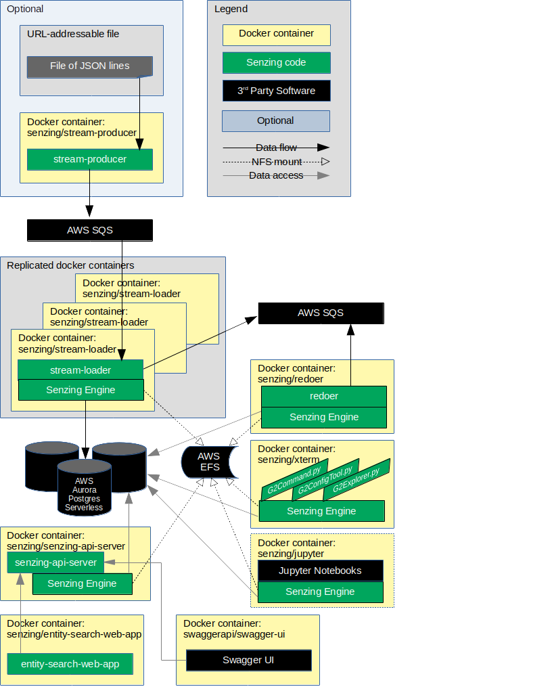

# aws-cloudformation-ecs-poc-simple

## Synopsis

The `aws-cloudformation-ecs-poc-simple` demonstrates a Senzing deployment using an AWS Cloudformation template.

## Overview

The `aws-cloudformation-ecs-poc-simple` demonstration is an AWS Cloudformation template that creates the following resources:

1. AWS infrastructure
    1. VPC
    1. Subnets
    1. Internet Gateway
    1. Routes
    1. IAM Roles and Policies
    1. Logging
1. AWS services
    1. AWS Elastic File System (EFS)
    1. AWS Simple Queue Service (SQS)
    1. AWS Relational Data Service (RDS) Aurora Postgres Serverless
    1. AWS Elastic Container Service (ECS) Fargate
1. Senzing services
    1. Senzing Stream-Loader
    1. Senzing Redoer
    1. Senzing API server
    1. Senzing Entity Search Web App
1. Optional services:
    1. SwaggerUI
    1. Senzing Stream-producer
    1. Senzing SSH access
    1. Senzing Xterm
    1. AWS VPC Flow Logs

The following diagram shows the relationship of the docker containers in this docker composition.
Arrows represent data flow.



This docker formation brings up the following docker containers:

1. *[senzing/entity-web-search-app](https://github.com/Senzing/entity-search-web-app)*
1. *[senzing/jupyter](https://github.com/Senzing/docker-jupyter)*
1. *[senzing/redoer](https://github.com/Senzing/redoer)*
1. *[senzing/senzing-api-server](https://github.com/Senzing/senzing-api-server)*
1. *[senzing/sshd](https://github.com/Senzing/docker-sshd)*
1. *[senzing/stream-loader](https://github.com/Senzing/stream-loader)*
1. *[senzing/stream-producer](https://github.com/Senzing/stream-producer)*
1. *[senzing/xterm](https://github.com/Senzing/docker-xterm)*

GitHub repository for
[aws-cloudformation-ecs-poc-simple](https://github.com/Senzing/aws-cloudformation-ecs-poc-simple).

### Contents

1. [Preamble](#preamble)
    1. [Legend](#legend)
1. [Expectations](#expectations)
1. [Demonstrate using AWS Console](#demonstrate-using-aws-console)
1. [Parameters](#parameters)
1. [Outputs](#outputs)

## Preamble

At [Senzing](http://senzing.com),
we strive to create GitHub documentation in a
"[don't make me think](https://github.com/Senzing/knowledge-base/blob/master/WHATIS/dont-make-me-think.md)" style.
For the most part, instructions are copy and paste.
Whenever thinking is needed, it's marked with a "thinking" icon :thinking:.
Whenever customization is needed, it's marked with a "pencil" icon :pencil2:.
If the instructions are not clear, please let us know by opening a new
[Documentation issue](https://github.com/Senzing/aws-cloudformation-ecs-poc-simple/issues/new?template=documentation_request.md)
describing where we can improve.   Now on with the show...

### Legend

1. :thinking: - A "thinker" icon means that a little extra thinking may be required.
   Perhaps there are some choices to be made.
   Perhaps it's an optional step.
1. :pencil2: - A "pencil" icon means that the instructions may need modification before performing.
1. :warning: - A "warning" icon means that something tricky is happening, so pay attention.

## Expectations

- **Space:** This repository and demonstration require 6 GB free disk space.
- **Time:** Budget 40 minutes to get the demonstration up-and-running.
- **Background knowledge:** This repository assumes a working knowledge of:
  - [AWS Cloudformation](https://github.com/Senzing/knowledge-base/blob/master/WHATIS/aws-cloudformation.md)

## Demonstrate using AWS Console

### Launch AWS Cloudformation

1. Visit [AWS Cloudformation with Senzing template](https://console.aws.amazon.com/cloudformation/home#/stacks/new?stackName=senzing-poc&templateURL=https://s3.amazonaws.com/public-read-access/aws-cloudformation-ecs-poc-simple/cloudformation-0.2.2.yaml)
1. In lower-right, click on "Next" button.
1. In **Specify stack details**
    1. In **Stack name**
        1. Enter an identifier of your choosing.
           Example: "senzing-poc"
    1. In **Parameters**
        1. In **Senzing installation**
            1. Accept the End User Licence Agreement
    1. Other parameters are optional.
    1. In lower-right, click "Next" button.
1. In **Configure stack options**
    1. In lower-right, click "Next" button.
1. In **Review {stack-name}**
    1. Near the bottom, in **Capabilities**
        1. Check ":ballot_box_with_check: I acknowledge that AWS CloudFormation might create IAM resources."
    1. In lower-right, click "Create stack" button.
1. Senzing formation takes about 15 minutes to fully deploy.

### Review AWS Cloudformation

The AWS resources created by the
[cloudformation.yaml](https://github.com/Senzing/aws-cloudformation-ecs-poc-simple/blob/main/cloudformation.yaml)
template can be see in the [AWS Management Console](https://console.aws.amazon.com).

1. CloudFormation
    1. [Stacks](https://console.aws.amazon.com/cloudformation/home?#/stacks)
1. CloudWatch
    1. [Log groups](https://console.aws.amazon.com/cloudwatch/home?#logsV2:log-groups)
1. Elastic Compute Cloud (EC2)
    1. [Load Balancers](https://console.aws.amazon.com/ec2/v2/home?#LoadBalancers:)
    1. [Network interfaces](https://console.aws.amazon.com/ec2/v2/home?#NIC)
    1. [Target groups](https://console.aws.amazon.com/ec2/v2/home?#TargetGroups:)
1. Elastic Container Service (ECS)
    1. [Clusters](https://console.aws.amazon.com/ecs/home?#/clusters)
    1. [Task Definitions](https://console.aws.amazon.com/ecs/home?#/taskDefinitions)
1. Elastic File System (EFS)
    1. [File systems](https://console.aws.amazon.com/efs/home?#/filesystems)
1. Identity and Access Management (IAM)
    1. [Policies](https://console.aws.amazon.com/iam/home?#/policies)
    1. [Roles](https://console.aws.amazon.com/iam/home?#/roles)
1. Lambda
    1. [Functions](https://console.aws.amazon.com/lambda/home?#/functions)
1. Relational Data Service (RDS)
    1. [Databases](https://console.aws.amazon.com/rds/home?#databases:)
    1. [Parameter groups](https://console.aws.amazon.com/rds/home?#parameter-groups:)
    1. [Subnet groups](https://console.aws.amazon.com/rds/home?#db-subnet-groups-list:)
1. Simple Queue Service (SQS)
    1. [Queues](https://console.aws.amazon.com/sqs/v2/home)
1. Virtual Private Cloud (VPC)
    1. [Elastic IP addresses](https://console.aws.amazon.com/vpc/home?#Addresses:)
    1. [Endpoints](https://console.aws.amazon.com/vpc/home?#Endpoints:)
    1. [Internet gateways](https://console.aws.amazon.com/vpc/home?#igws)
    1. [NAT gateways](https://console.aws.amazon.com/vpc/home?#NatGateways:)
    1. [Network ACLs](https://console.aws.amazon.com/vpc/home?#acls)
    1. [Route Tables](https://console.aws.amazon.com/vpc/home?#RouteTables)
    1. [Security Groups](https://console.aws.amazon.com/vpc/home?#SecurityGroups)
    1. [Subnets](https://console.aws.amazon.com/vpc/home?#subnets)
    1. [VPCs](https://console.aws.amazon.com/vpc/home?#vpcs)

### View results

1. Visit [AWS Cloudformation console](https://console.aws.amazon.com/cloudformation/home).
1. Choose appropriate "Stack name"
1. Choose "Outputs" tab.
    1. For descriptions of outputs, click on the value for `ADescriptionOfOutputs`,
       which links to [Outputs](#outputs) further down this page.

## Parameters

Technical information on AWS Cloudformation parameters can be seen at
[Parameters](https://docs.aws.amazon.com/AWSCloudFormation/latest/UserGuide/parameters-section-structure.html).

### AcceptEula

1. **Synopsis:**
   To use the Senzing code, you must agree to the End User License Agreement (EULA).
   This step is intentionally tricky to ensure that you make a conscious effort to accept the EULA.
1. **Required:** Yes
1. **Type:** String
1. **Allowed values:** See [SENZING_ACCEPT_EULA](https://github.com/Senzing/knowledge-base/blob/master/lists/environment-variables.md#senzing_accept_eula).
1. **Default:** None

### CidrInbound

1. **Synopsis:** The password used to access the AWS Aurora Postgres Serverless databases.
1. **Required:** Yes
1. **Type:** String
1. **Allowed pattern:** Letters and numbers. Specifically: `'(?:\d{1,3}\.){3}\d{1,3}(?:/\d\d?)?'`
1. **Allowed values:** String in IPv4 [CIDR format](https://en.wikipedia.org/wiki/Classless_Inter-Domain_Routing).
1. **Example:** 45.26.129.200/32
1. **Default:** 0.0.0.0/0

### SenzingLicenseAsBase64

1. **Synopsis:**
   To ingest more than 100,000 records, a Senzing license is required.
   A binary version of the Senzing license, `g2.lic`, is not usable as a parameter in the text entry field.
   Instead, a [Base64](https://en.wikipedia.org/wiki/Base64) representation of the information is needed.
   An example of how to produce base64 from `g2.lic` on Linux and macOS:

   ```console
   base64 /opt/senzing/etc/g2.lic
   ```

   Copy the entire output from the command and paste into the text entry field.
1. **Required:** Yes if ingesting more than 100,000 records, otherwise no.
1. **Type:** String
1. **Allowed pattern:** Empty or Base64 characters. Specifically `^$|[^-A-Za-z0-9+/=]|=[^=]|={3,}$`
1. **Allowed values:** Base64 encoded string
1. **Example:**

   ```console
   AQAAADgCAAAAAAAAU2VuemluZwAAAAAAAAAAAAAAAAAAAAAAAAAAAAAAAAAAAAAAAAAAAAAAAAAA
   AAAAAAAAAAAAAAAAAAAAAAAAAAAAAAAAAAAAAAAAAAAAAAAAAAAAAAAAAAAAAAAAAAAAAAAAAAAA
   AAAAAAAAAAAAAAAAAAAAAAAAAAAAAAAAAAAAAAAAAAAAAAAAAAAAAAAAAAAAAAAAAAAAAAAAAAAA
   AAAAAAAAAAAAAAAAAAAAAAAAAAAAAAAAAAAAAAAAAAAAAAAAAAAAAAAAAAAAAAAAAAAAAAAAAAAA
   AAAAAAAAAAAAAAAAAAAAAAAAAAAAAAAAAAAAAAAAAAAAAAAAAAAARGVtbyBFeHBpcmVkAAAAAAAA
   AAAAAAAAAAAAAAAAAAAAAAAAAAAAAAAAAAAAAAAAAAAAAAAAAAAAAAAAAAAAADIwMjAtMTItMTYA
   AAAAAAAAAAAARVZBTAAAAAAAAAAAAAAAAAAAAAAAAAAAAAAAAAAAAAAAAAAAAAAAAAAAAAAAAAAA
   AAAAAAAAAAAAAAAAAAAAAFNUQU5EQVJEAAAAAAAAAAAAAAAAAAAAAAAAAAAAAAAAAAAAAAAAAAAA
   AAAAAAAAAAAAAAAAAAAAAAAAAAAAAAAAAAAAAKCGAQAAAAAAMTk3Ni0wMS0wMQAAAAAAAAAAAABN
   T05USExZAAAAAAAAAAAAAAAAAAAAAAAAAAAAAAAAAAAAAAAAAAAAAAAAAAAAAAAAAAAAAAAAAAAA
   AAAAAAAARkdIST5XYOZ90kbyAbU7wM7XvPCwq/FgORZIekwFMg8zi3tCD0V5+12q72aqk0E6JOct
   +cPAq/T50N5Pf5nvJZ6TaW3TzQbnH/z5f/ALsWLydE2DPNvq3HuAjkjZpg2h7mb4OUqorGxDI9RX
   TX8hPjzYrBfMdOgl1DlRBVG36WwdpB8AnSfaegbYU+U/vfof+ff6mJk8gzPg+OGPwg21/S6i2TT4
   RbTCSYP/TpfXyJGE6dbQWEC9rFhYuWq3mFF3z7zFEcmxpNfZuBtYsxni8P3sDZ706RA+wcQF7TVg
   giJoK03W8kd6mk3X+fvc4ARJo9RarYInsAvSHKlr1KpxeebuirfqgSz+uEW6pqOD1fV0oHnFncdf
   jV2k2CqmIfThB/ONQcn/4/EIlhdzXqxSlXAGz6C7ApHq6xUCdLILx/NfdUEypHIfyabrpXKOKOPx
   zekhGztEzB0gSJNebEa++EKxHDOc1Sc0YD9q9KvcaGSPTjlCJeaNhufg9Sz/iXZMP+d4Vkp+Bn6p
   mfUPG7tKharEoRChUNfRms8wVyNxmz6LRw5Uy14Dlodd0LyBQRB9Tx8FVYMh5AElwjbQOoDOIRvi
   IQIGsUNp/ZkP7PdBxc/b9o3rjUsZCzyCtP+jflZSqMenzXCsTI1Xay6On2wSVwQdJ1/2eIwKEfCF
   hj4DZlY5+jSo
   ```

1. **Default:** None

## Outputs

### ApiServerHeartbeatUrl

1. **Synopsis:**
   A URL showing how to reach the
   [Senzing API Server](https://github.com/Senzing/senzing-api-server)
   directly.
   The `/heartbeat` URI path simply demonstrates that the API server is responding.
1. **Details:**
   For more URIs, see
   [SwaggerUrl output value](#swaggerurl).

### DatabaseHostCore

1. **Synopsis:**
   More information at [AWS RDS Console](https://console.aws.amazon.com/rds/home).

### DatabaseHostLibfeat

1. **Synopsis:**
   More information at [AWS RDS Console](https://console.aws.amazon.com/rds/home)

### DatabaseHostRes

1. **Synopsis:**
   More information at [AWS RDS Console](https://console.aws.amazon.com/rds/home)

### DatabaseName

1. **Synopsis:**
   The name of the database.
1. **Details:**
   Usually "G2".

### DatabasePassword

1. **Synopsis:**
   The randomly-generated administrative password for authenticating with the database.

### DatabasePortCore

1. **Synopsis:**
   The port used to access each of the databases.
1. **Details:**
   More information at [AWS RDS Console](https://console.aws.amazon.com/rds/home).

### DatabasePortLibfeat

1. **Synopsis:**
   The port used to access each of the databases.
1. **Details:**
   More information at [AWS RDS Console](https://console.aws.amazon.com/rds/home).

### DatabasePortRes

1. **Synopsis:**
   The port used to access each of the databases.
1. **Details:**
   More information at [AWS RDS Console](https://console.aws.amazon.com/rds/home).

### DatabaseUsername

1. **Synopsis:**
   The administrative user name for authenticating with the database.

### Ec2Vpc

1. **Synopsis:**
   The AWS Resource ID of the Virtual Private Cloud (VPC).
1. **Details:**
   More information at [AWS VPC Console](https://console.aws.amazon.com/vpc/home?#vpcs:).

### Host

1. **Synopsis:**
   The hostname of the loadbalancer that is a proxy to all of the services.
1. **Details:**
   More information at [AWS Load Balancers console](https://console.aws.amazon.com/ec2/v2/home?#LoadBalancers:).
   Also used as the `host` value when using [SwaggerUrl](#swaggerurl).

### JupyterUrl

1. **Synopsis:**
   A URL showing how to reach the
   [Jupyter Notebooks](https://github.com/Senzing/docker-jupyter).

### Queue

1. **Synopsis:**
   The queue from which records are ingested into Senzing Engine.
   In otherwords, this is the queue where records are sent to be inserted into the Senzing Engine.
1. **Details:**
   More information at [AWS SQS Console](https://console.aws.amazon.com/sqs/v2/home?#/queues).

### QueueDeadLetter

1. **Synopsis:**
   The queue to which records that are not able to be ingested into Senzing Engine are sent.
   In otherwords, if the JSON message is malformed, or Senzing d into the Senzing Engine.
1. **Details:**
   More information at [AWS SQS Console](https://console.aws.amazon.com/sqs/v2/home?#/queues).

### SshPassword

1. **Synopsis:**
   A randomly generated password to be used with the sshd tasks.

### SubnetPublic1

1. **Synopsis:**
   The first of two public subnets created.
1. **Details:**
   See the subnet having a Name in the form `{StackName}-ec2-subnet-public-1` in the
   [AWS Virtual Private Cloud console](https://console.aws.amazon.com/vpc/home?#subnets:).

### SubnetPublic2

1. **Synopsis:**
   The second of two public subnets created.
1. **Details:**
   See the subnet having a Name in the form `{StackName}-ec2-subnet-public-2` in the
   [AWS Virtual Private Cloud console](https://console.aws.amazon.com/vpc/home?#subnets:).

### SwaggerUrl

1. **Synopsis:**
   A URL showing how to reach the
   [Swagger User Interface](https://github.com/swagger-api/swagger-ui).
1. **Usage:**
   To access the Senzing API server
    1. Using the URL, visit the `SwaggerUrl` webpage.
    1. In **Servers**
        1. From the drop-down, select `{protocol}://{host}:{port}`.
        1. In the **Host** field, enter the value of [Host](#host).
    1. The HTTP URIs will now access the deployed Senzing API server.

### WebAppUrl

1. **Synopsis:**
   A URL showing how to reach the
   [Senzing Entity Search Web App](https://github.com/Senzing/entity-search-web-app).

### XtermUrl

1. **Synopsis:**
   A URL showing how to reach the
   [Senzing Xterm](https://github.com/Senzing/docker-xterm).
1. **Usage:**
   From this Linux terminal, `G2Command.py`, `G2Explorer.py`, `G2ConfigTool.py`,
   can be run.
